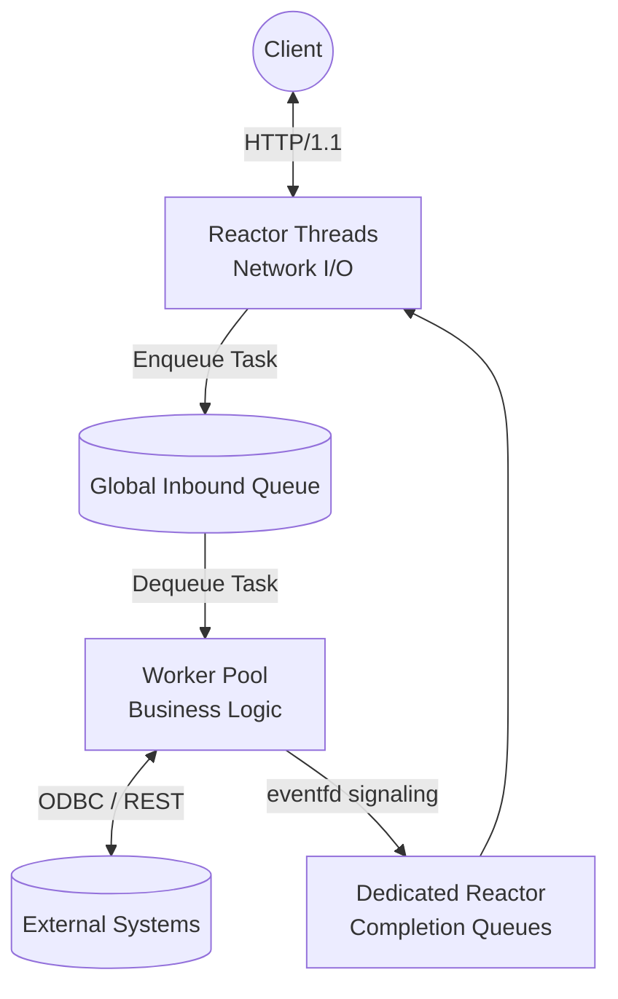
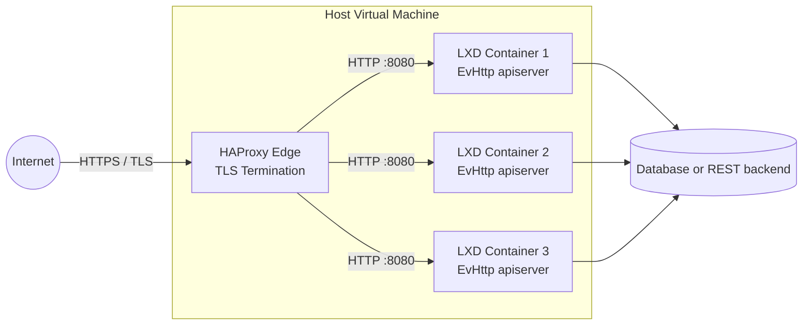

# EvHttp API Server

**EvHttp API Server** is a high-performance, strictly-typed C23 web server and REST API gateway. Built on top of `libevent` and `json-c`, it utilizes a highly concurrent multithreaded reactor/worker-pool architecture to aggregate data from legacy ODBC SQL databases and external microservices. It is designed to be extremely fast, memory-safe, and capable of gracefully sustaining massive bursts of traffic.
### Internal Architecture


## Features
* **Thread-Safety & Memory-Safety:** Rigorously profiled with Google's AddressSanitizer (ASAN) and ThreadSanitizer (TSAN) to eliminate data races, memory leaks, and undefined behavior.
* **Performance & Scalability:** Engineered for high-throughput, utilizing non-blocking `epoll` I/O.
* **Hardware-Aware Affinity:** Uses `SO_REUSEPORT` with thread-per-core affinity to automatically adapt to available CPU cores for zero-contention network routing.
* **Cloud-Native Telemetry:** Native compatibility with Promtail/Loki via single-line JSON structured logging (`journalctl`), alongside a dedicated `/metrics` endpoint for Prometheus and `curl` scraping.
* **Zero-Downtime Hot Reload:** Send a `SIGHUP` signal to the process to hot-reload configurations (`apiserver.env`) without dropping active sockets.
* **LXD Edge-Ready:** Ideal for bare-metal deployments inside LXD native Linux containers positioned behind an HAProxy TLS termination edge.
* **Ultra-Lightweight Footprint:** The compiled binary weighs approximately ~70KB and consumes less than 0.5% of RAM under extreme stress loads (tested on an 8GB VM).
* **Extensive Code Examples:** Out-of-the-box templates and reference implementations for building API endpoints that execute legacy ODBC queries and orchestrate external downstream REST services.

## Repository
**GitHub:** `git@github.com:cppservergit/evhttp-apiserver.git`  
**Branch:** `main`

## Recommended Environments
This project embraces modern C23 standards and strict compiler safety flags. We recommend developing on:
* **Ubuntu 24.04 LTS** utilizing **GCC 14**
* **Ubuntu 26.04 LTS** utilizing **GCC 15**

## Development Installation

### 1. Install Dependencies
Install the required development headers and libraries. 

For Ubuntu 24.04 and 26.04:
```bash
sudo apt-get update
sudo apt-get install -y build-essential gcc make \
                        libevent-dev \
                        libjson-c-dev \
                        libcurl4-openssl-dev \
                        unixodbc-dev \
                        tdsodbc
```

### 2. Clone the Repository
```bash
git clone git@github.com:cppservergit/evhttp-apiserver.git
cd evhttp-apiserver
```

### 3. Configure the Environment
The server requires an `apiserver.env` configuration file in the `bin/` directory.

```bash
mkdir -p bin
cat <<EOF > bin/apiserver.env
ODBC_CONN_STR=Driver=FreeTDS;SERVER=demodb.mshome.net;PORT=1433;DATABASE=demodb;UID=sa;PWD=your_password;APP=apiserver;Encryption=off;ClientCharset=UTF-8
API_URL=https://cppserver.com
API_USER=mcordova
API_PASS=basica
ACCESS_LOG=true
NUM_THREADS=12
MAX_QUEUE_SIZE=10000
EOF
```

### 4. Build and Run
The project uses a standard Makefile. The compiled binary will be placed in the `bin/` directory.

```bash
# Compile the optimized release build
make release

# Run the server
./bin/apiserver
```

### 5. Advanced Targets (Sanitizers)
To profile the architecture under load, you can build with Google Sanitizers:
```bash
make asan   # Builds bin/test_asan (Address/Leak Sanitizer)
make tsan   # Builds bin/test_tsan (Thread Sanitizer)
```

### 6. Stress Testing
A dedicated testing suite is provided via `test/test.sh`. This script will automatically compile the server across all target configurations (Release, ASAN, TSAN) and bombard it with massive parallel curl requests to validate stability, thread safety, and memory leak freedom under extreme concurrency.
```bash
cd test
./test.sh
```

## Production Deployment
For production environments, the server is designed to run securely as a persistent `systemd` daemon with automatic restart, logging, and hot-reload capabilities. 

Please see the [Systemd Installation Guide](systemd/install.md) for full instructions on deploying the binary and configuring the service.

### Recommended Topology


## License
This project is licensed under the 3-Clause BSD License - see the [LICENSE](LICENSE) file for details.
