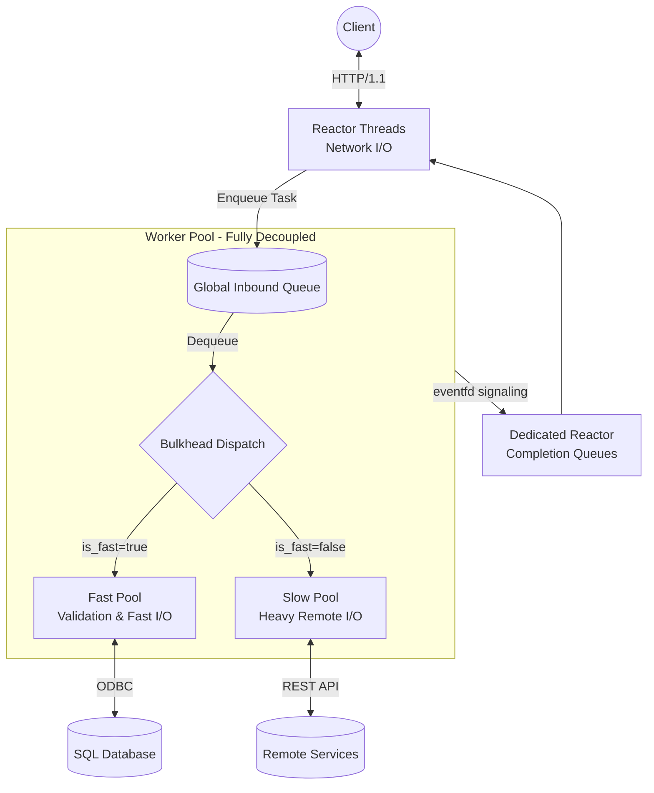
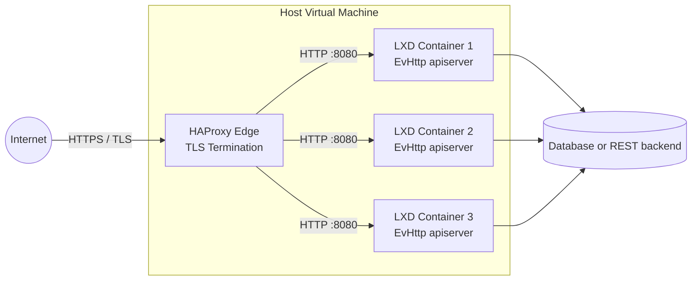

# EvHttp API Server

**EvHttp API Server** is a high-performance, strictly-typed C23 web server and REST API gateway. Built on top of `libevent` and `json-c`, it utilizes a highly concurrent multithreaded reactor/worker-pool architecture to aggregate data from ODBC SQL databases and external microservices. It is designed to be extremely fast, memory-safe, and capable of gracefully sustaining massive bursts of traffic.
### Internal Architecture


## Features
* **Optimized Struct Memory Layout & False Sharing Prevention:** All C structures are strictly sorted from largest to smallest alignment requirements and explicitly padded to exact 64-byte cache-line boundaries. This mathematically eliminates internal compiler padding holes and guarantees that concurrent threads do not suffer performance penalties from False Sharing across all 64-bit architectures (x86-64, ARM64, etc.). Verified strictly with `-Wpadded`.
* **Strict Security Compliance (SEI CERT C):** The codebase formally adheres to the SEI CERT C secure coding standards (`cert-*`).
* **Hardware-Enforced Memory Safety:** Actively utilizes C23's `<stdckdint.h>` checked math macros (`ckd_add`, `ckd_mul`) for all dynamic memory allocations and buffer re-sizings to formally guarantee mathematical immunity against integer-overflow-induced heap corruption.
* **Thread-Safety & Memory-Safety:** Rigorously profiled and tested under extreme stress loads (80 concurrent client threads hitting all API handlers simultaneously) using Google's AddressSanitizer (ASAN), ThreadSanitizer (TSAN), and Valgrind to validate the architecture against data races, memory leaks, and undefined behavior.
* **Lock-Free Single-Flight JWT Authentication (Remote APIs):** For API handlers that connect to remote REST services, the server implements a leader-follower concurrency pattern to eliminate thundering herd requests. Ensures that out of thousands of concurrent worker threads, exactly ONE thread performs the network refresh for an expired JWT, while the others sleep efficiently on condition variables—avoiding global read/write lock contention.
* **Zero-Copy Reactor/Worker Hot-Path:** Decouples JSON parsing, schema validation, and JWT verification from the `libevent` reactor threads. By explicitly taking ownership of the request memory (`evhttp_request_own()`), the reactors execute a safe, zero-copy handoff of the pointer to the background pool. This structurally prevents Use-After-Free races on client disconnects and allows the core loops to sustain massive TCP bursts without CPU blocking.
* **Bulkheading Architecture:** Dynamically segments worker threads into separate "fast" and "slow" pools based on configuration (`FAST_POOL_PERCENTAGE`). This guarantees that slow external APIs never starve resources from fast database queries or health checks.
* **Zero-Allocation Intrusive Queues:** Eliminates `malloc`/`free` bottlenecks on the critical request path by embedding intrusive linked-list pointers directly into the task state. This prevents memory fragmentation, OOM crashes under extreme load, and glibc lock contention.
* **Object Pool / Slab Allocator:** Pre-allocates request task structures at startup and manages an O(1) Mutex-guarded free-list stack. This guarantees exactly zero dynamic heap allocations on the critical path, acting as a natural backpressure valve if traffic surges beyond bounds.
* **Event Coalescing:** Eliminates "System Call Storms" by intelligently coalescing `eventfd` signals on asynchronous pipe boundaries, significantly reducing kernel context switches under high load.
* **High-Performance Asynchronous Logging:** Implements a dedicated background logger thread utilizing a mutex-guarded ring buffer and a pre-allocated object pool. Workers seamlessly offload `STDERR` I/O without synchronous blocking, utilizing POSIX atomic guarantees (`PIPE_BUF`) to ensure thread-safe, non-interleaved log streams.
* **Optimized Thread Signaling:** Utilizes the "Unlock-before-Signal" pattern to prevent spurious wait-morphing overhead and lock contention when waking sleeping background workers.
* **Performance & Scalability:** Engineered for high-throughput, utilizing non-blocking `epoll` I/O.
* **Hardware-Aware Affinity:** Uses `SO_REUSEPORT` with thread-per-core affinity to automatically adapt to available CPU cores for zero-contention network routing.
* **Cloud-Native Telemetry:** Native compatibility with Promtail/Loki via single-line JSON structured logging (`journalctl`), alongside a dedicated `/metrics` endpoint for Prometheus and `curl` scraping.
* **Zero-Downtime Hot Reload:** Send a `SIGHUP` signal to the process to hot-reload configurations (`apiserver.env`) without dropping active sockets.
* **LXD Edge-Ready:** Ideal for bare-metal deployments inside LXD native Linux containers positioned behind an HAProxy TLS termination edge.
* **Ultra-Lightweight Footprint:** The compiled binary weighs approximately ~70KB and features ultra low memory consumption.
* **Extensive Code Examples:** Out-of-the-box templates and reference implementations for building API endpoints that execute ODBC queries and orchestrate external downstream REST services.
* **Efficient use of ODBC API:** Transparent connection pooling per worker thread with reconnect on error, and highly optimized `SQLGetData` stream-reading to seamlessly process JSON database payloads with virtually zero memory overhead.
* **Built-in JWT support:** Stateless security model that generates and validates JWT tokens using `libsodium`.
* **Built-in TOTP support:** Sample code provided to generate TOTP QR code and validate a TOTP using `libqrencode` and `liboath` respectively.
* **Built-in MCP support:** Includes and endpoint to implement as a server the Model Context Protocol to be consumed by AI agents, with a sample tool.

## Clean data-driven C Design

The codebase enforces a strict physical separation of concerns:
* **`lib/`**: Contains the highly-optimized, reusable core framework (Reactors, Worker Pools, DB drivers). Compiled as `libapiserver.a`.
* **`src/`**: Contains only the user's business logic, handlers, and the `main.c` entry point.

### Declarative API Routing
Endpoints are defined using a crisp, array-based routing table mapped directly to callback handlers and optional validation schemas inside `src/main.c`:
```c
static const middleware_ctx_t g_routes[] = {
    { .path = "/ping", .allowed_method = EVHTTP_REQ_GET, .validation_ctx = nullptr, .handler = ping_handler, .user_arg = nullptr, .is_fast = true, .auth_mode = AUTH_NONE },
    { .path = "/sales", .allowed_method = EVHTTP_REQ_POST, .validation_ctx = &SalesContext, .handler = sales_handler, .user_arg = nullptr, .is_fast = true, .auth_mode = AUTH_JWT },
    { .path = "/customer", .allowed_method = EVHTTP_REQ_POST, .validation_ctx = &CustomerContext, .handler = customer_handler, .user_arg = nullptr, .is_fast = true, .auth_mode = AUTH_JWT },
    { .path = "/metrics", .allowed_method = EVHTTP_REQ_GET, .validation_ctx = nullptr, .handler = metrics_handler, .user_arg = nullptr, .is_fast = true, .auth_mode = AUTH_API_KEY }
};
```

### Declarative JSON Validation
Avoid messy manual JSON parsing. Define a strict schema and let the framework automatically validate types and execute custom logical boundaries before the handler is even invoked:
```c
static const FieldValidator SalesSchema[] = {
    {.field_name = "start_date", .type = TYPE_DATE,   .is_required = true},
    {.field_name = "end_date",   .type = TYPE_DATE,   .is_required = true}
};

const ValidationContext SalesContext = {
    .schema = SalesSchema,
    .schema_count = sizeof(SalesSchema) / sizeof(SalesSchema[0]),
    .global_validator = &sales_invariant_validator
};
```

## Repository
**GitHub:** `git@github.com:cppservergit/evhttp-apiserver.git`  
**Branch:** `main`

## Recommended Environments
This project embraces modern C23 standards and strict compiler safety flags. We recommend developing on:
* **Ubuntu 24.04 LTS** utilizing **GCC 14**
* **Ubuntu 26.04 LTS** utilizing **GCC 15**
* **GCC 16.1** using the official docker image gcc:16.1 on Ubuntu 24.04 or 26.04.

## Development Installation

### 1. Install Dependencies
Install the required development headers and libraries. 

For Ubuntu 24.04 and 26.04:
```bash
sudo apt update
sudo apt install -y build-essential gcc make \
                        libevent-dev \
                        libjson-c-dev \
                        libcurl4-openssl-dev \
                        unixodbc-dev \
                        libsodium-dev \
                        libqrencode-dev \
                        liboath-dev
```

**Note:** Install the open source ODBC drivers to connect evhttp-apiserver to SQL Server, Sybase and PostgreSQL. 
```bash
sudo apt install tdsodbc odbc-postgresql
```

### 2. Clone the Repository and compile it
```bash
git clone https://github.com/cppservergit/evhttp-apiserver.git
cd evhttp-apiserver
make
```

### 3. Configure the Environment
The server requires an `apiserver.env` configuration file in the `bin/` directory.
Consider using `openssl rand -hex 32` to generate the JWT secret and the API KEY for the built-in telemetry endpoints.

```bash
mkdir -p bin
cat <<EOF > bin/apiserver.env
# ODBC connection strings - you can define from DB_0 to DB_3
DB_0=Driver=FreeTDS;SERVER=DatabaseServerAddr;PORT=1433;DATABASE=demodb;UID=YourUsername;PWD=YourPassword;APP=apiserver;Encryption=off;ClientCharset=UTF-8
#DB_1=Driver={PostgreSQL Unicode};Server=DatabaseServerAddr;Port=5432;Database=testdb;Username=YourUsername;Password=YourPassword;ConnSettings=SET application_name='apiserver';TextAsLongVarchar=1;MaxLongVarcharSize=0;BoolsAsChar=0;


# enable access logs - can be changed on the fly and supports service reload
ACCESS_LOG=true

# server configuration - any change requires service restart
NUM_THREADS=12
MAX_QUEUE_SIZE=10000
FAST_POOL_PERCENTAGE=25
MAX_PAYLOAD_SIZE=5242880
SERVER_PORT=8080

# remote login provider
LOGIN_PROVIDER=http://demodb.mshome.net:8080
LOGIN_URI=/login

# jwt configuration

# secret and api key generated with: openssl rand -hex 32
JWT_SECRET=your_jwt_secret
JWT_TIMEOUT_SECONDS=300
TELEMETRY_API_KEY=your_telemetry_key

# trust haproxy IP for accepting X-Forwarded-For header
TRUST_PROXY_IP=127.0.0.1

# cors configuration
CORS_ALLOWED_ORIGINS=file://,null,https://cppserver.com

# uploads directory - must be writable by the apiserver user
UPLOADS_DIR=/opt/uploads

# remote backend API configuration
API_URL=https://cppserver.com
API_USER=your_api_user
API_PASS=your_api_pass
REMOTE_API_KEY=your_api_key
EOF
```

### 4. Build and Run
The project uses a standard Makefile. The compiled binary will be placed in the `bin/` directory.

Available Makefile targets:
* `make release` - Compiles the optimized release build **with** debug symbols (`-g`) embedded for detailed core dumps.
* `make slim` - Compiles the optimized release build without debug symbols and strips the binary for the smallest possible footprint.
* `make clean` - Cleans the `obj/` and `bin/` directories.
* `make asan` - Builds `bin/test_asan` using Google's AddressSanitizer (detects memory leaks and out-of-bounds access).
* `make tsan` - Builds `bin/test_tsan` using Google's ThreadSanitizer (detects data races).
* `make valgrind` - Builds `bin/test_valgrind` optimized for Valgrind profiling (`-O1` without sanitizers).

```bash
# Example: Compile and run the release build
make clean && make release
./bin/apiserver
```

### 5. Core Dump Analysis (Ubuntu 24.04 / 26.04)
By default, Ubuntu 24.04 and 26.04 use **Apport** to intercept crashes, which silently ignores binaries that aren't installed via a package manager (`apt`). If `apiserver` crashes during development, it will leave no trace.

To configure Ubuntu to drop standard `core.<PID>` files directly into your working directory (e.g. `bin/`) for immediate analysis, run the following in your terminal:

```bash
# 1. Instruct the kernel to drop core files locally
sudo sysctl -w kernel.core_pattern=core.%p

# 2. Allow unlimited core dump sizes in your current shell session
ulimit -c unlimited
```

If the server crashes, a `core.<PID>` file will instantly appear. Ensure you built the server using `make release` (which includes debug symbols), and analyze the crash using GDB:

```bash
gdb ./bin/apiserver core.<PID>
# Inside GDB, type 'bt' or 'bt full' to see the exact line of code that caused the crash.
```

### 6. Advanced Testing
To profile the architecture under load and verify correctness, use the sanitizers described in the Makefile targets above.

Additionally, the project features a comprehensive unit test suite for the declarative JSON input validation framework. The framework is aggressively tested against edge cases (type confusion, null-byte injection, leap year boundary traps, missing required fields, etc.) and maintains **100% code coverage**.

To run the validation test suite and verify code coverage:
```bash
cd test
make coverage
```

### 7. Stress Testing
A dedicated stress testing script is provided via `test/test.sh`. This script will bombard your running server with massive parallel `curl` requests to validate connection handling, thread-safety, and latency under extreme concurrency. Ensure the server is already compiled and running before executing the suite.
```bash
cd test
./test.sh
```

## Production Deployment
For production environments, the server is designed to run as a persistent `systemd` daemon with automatic restart, logging, and hot-reload capabilities. 

Please see the [Systemd Installation Guide](systemd/install.md) for full instructions on deploying the binary and configuring the service.

### Recommended Topology


## License
This project is licensed under the 3-Clause BSD License - see the [LICENSE](LICENSE) file for details.

## Example: API Handler via ODBC
For a comprehensive guide on writing database API handlers, please see the [Developer Guide (skills.md)](skills.md).

Below is a complete example of how the framework handles a POST request to `/sales`, streaming the response directly from ODBC into the network socket without intermediate heap allocations.

### 1. The Request Handler (`src/handlers.c`)
Because the framework handles the JSON parsing and validation automatically, the handler simply binds the validated parameters into a `QueryParam` array and calls the `dbapi` streaming abstraction:

```c
void sales_handler(
    struct json_object* body, 
    int* out_status, 
    struct evbuffer* out_buf
) {
    *out_status = HTTP_OK;
    
    const char* start_date = json_get_string(body, "start_date");
    const char* end_date = json_get_string(body, "end_date");
    
    QueryParam params[] = {
        { .type = PARAM_STRING, .value = start_date },
        { .type = PARAM_STRING, .value = end_date }
    };
    
    if (!db_get_json(DB_0, "{CALL sp_sales_by_category(?,?)}", params, ARRAY_SIZE(params), out_buf, __func__)) {
        *out_status = HTTP_INTERNAL;
    }
}
```

### 3. Execution & Output
You can test this endpoint natively from the terminal. The framework automatically embeds telemetry and thread execution metadata into every response.

```bash
curl "http://localhost:8080/sales" -s --json '{"start_date": "1994-01-01", "end_date": "1996-12-31"}' | jq
```

**JSON Output:**
```json
{
  "data": [
    {
      "id": 1,
      "item": "Beverages",
      "subtotal": 267868.1800000
    },
    {
      "id": 4,
      "item": "Dairy Products",
      "subtotal": 234507.2850000
    },
    {
      "id": 3,
      "item": "Confections",
      "subtotal": 167357.2250000
    }
  ],
  "thread_id": "0x7f08cdffb6c0",
  "elapsed_ns": 14592908,
  "hostname": "cpp14"
}
```
