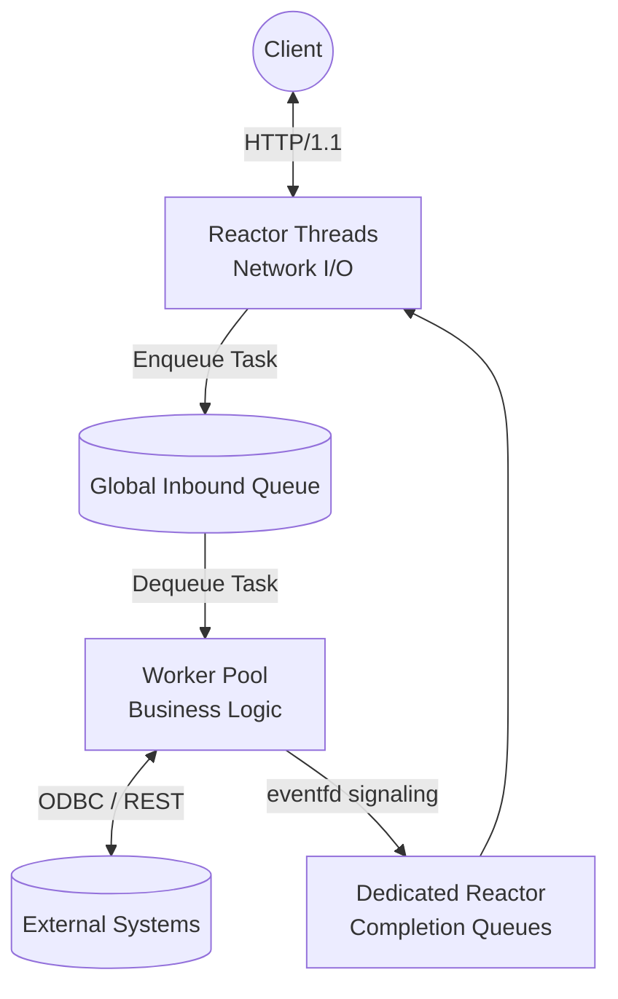
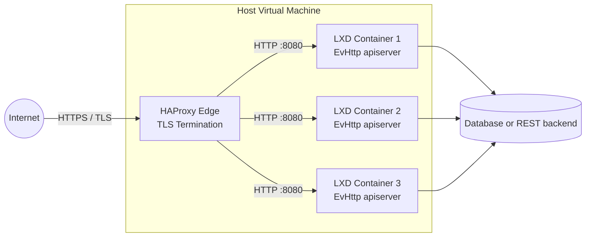

# EvHttp API Server

**EvHttp API Server** is a high-performance, strictly-typed C23 web server and REST API gateway. Built on top of `libevent` and `json-c`, it utilizes a highly concurrent multithreaded reactor/worker-pool architecture to aggregate data from legacy ODBC SQL databases and external microservices. It is designed to be extremely fast, memory-safe, and capable of gracefully sustaining massive bursts of traffic.
### Internal Architecture


## Features
* **Thread-Safety & Memory-Safety:** Rigorously profiled with Google's AddressSanitizer (ASAN) and ThreadSanitizer (TSAN) to eliminate data races, memory leaks, and undefined behavior.
* **Bulkheading Architecture:** Dynamically segments worker threads into separate "fast" and "slow" pools based on configuration (`FAST_POOL_PERCENTAGE`). This guarantees that slow external APIs never starve resources from fast database queries or health checks.
* **Performance & Scalability:** Engineered for high-throughput, utilizing non-blocking `epoll` I/O.
* **Hardware-Aware Affinity:** Uses `SO_REUSEPORT` with thread-per-core affinity to automatically adapt to available CPU cores for zero-contention network routing.
* **Cloud-Native Telemetry:** Native compatibility with Promtail/Loki via single-line JSON structured logging (`journalctl`), alongside a dedicated `/metrics` endpoint for Prometheus and `curl` scraping.
* **Zero-Downtime Hot Reload:** Send a `SIGHUP` signal to the process to hot-reload configurations (`apiserver.env`) without dropping active sockets.
* **LXD Edge-Ready:** Ideal for bare-metal deployments inside LXD native Linux containers positioned behind an HAProxy TLS termination edge.
* **Ultra-Lightweight Footprint:** The compiled binary weighs approximately ~70KB and consumes less than 1% of RAM under extreme stress loads (tested on an 8GB VM).
* **Extensive Code Examples:** Out-of-the-box templates and reference implementations for building API endpoints that execute legacy ODBC queries and orchestrate external downstream REST services.

## Clean C Design

### Declarative API Routing
Endpoints are defined using a crisp, array-based routing table mapped directly to callback handlers and optional validation schemas:
```c
static const middleware_ctx_t g_routes[] = {
    { .path = "/ping", .allowed_method = EVHTTP_REQ_GET, .validation_ctx = nullptr, .json_handler = ping_handler, .is_fast = true },
    { .path = "/sales", .allowed_method = EVHTTP_REQ_POST, .validation_ctx = &SalesContext, .json_handler = sales_handler, .is_fast = true },
    { .path = "/customer", .allowed_method = EVHTTP_REQ_POST, .validation_ctx = &CustomerContext, .json_handler = customer_handler, .is_fast = false },
    { .path = "/metrics", .allowed_method = EVHTTP_REQ_GET, .validation_ctx = nullptr, .text_handler = metrics_handler, .is_fast = true }
};
```

### Declarative JSON Validation
Avoid messy manual JSON parsing. Define a strict schema and let the framework automatically validate types and execute custom logical boundaries before the handler is even invoked:
```c
static const FieldValidator SalesSchema[] = {
    {.field_name = "start_date", .type = TYPE_DATE, .is_required = true, .custom_validator = NULL},
    {.field_name = "end_date",   .type = TYPE_DATE, .is_required = true, .custom_validator = NULL}
};

const ValidationContext SalesContext = {
    .schema = SalesSchema,
    .schema_count = sizeof(SalesSchema) / sizeof(SalesSchema[0]),
    .global_validator = validate_start_before_end
};
```

## Repository
**GitHub:** `git@github.com:cppservergit/evhttp-apiserver.git`  
**Branch:** `main`

## Recommended Environments
This project embraces modern C23 standards and strict compiler safety flags. We recommend developing on:
* **Ubuntu 24.04 LTS** utilizing **GCC 14**
* **Ubuntu 26.04 LTS** utilizing **GCC 15**

## Development Installation

### 1. Install Dependencies
Install the required development headers and libraries. 

For Ubuntu 24.04 and 26.04:
```bash
sudo apt-get update
sudo apt-get install -y build-essential gcc make \
                        libevent-dev \
                        libjson-c-dev \
                        libcurl4-openssl-dev \
                        unixodbc-dev \
                        tdsodbc
```

### 2. Clone the Repository
```bash
git clone git@github.com:cppservergit/evhttp-apiserver.git
cd evhttp-apiserver
```

### 3. Configure the Environment
The server requires an `apiserver.env` configuration file in the `bin/` directory.

```bash
mkdir -p bin
cat <<EOF > bin/apiserver.env
ODBC_CONN_STR=Driver=FreeTDS;SERVER=demodb.mshome.net;PORT=1433;DATABASE=demodb;UID=sa;PWD=your_password;APP=apiserver;Encryption=off;ClientCharset=UTF-8
API_URL=https://cppserver.com
API_USER=mcordova
API_PASS=basica
ACCESS_LOG=true
NUM_THREADS=12
MAX_QUEUE_SIZE=10000
FAST_POOL_PERCENTAGE=25
EOF
```

### 4. Build and Run
The project uses a standard Makefile. The compiled binary will be placed in the `bin/` directory.

```bash
# Compile the optimized release build
make release

# Run the server
./bin/apiserver
```

### 5. Advanced Targets (Sanitizers)
To profile the architecture under load, you can build with Google Sanitizers:
```bash
make asan   # Builds bin/test_asan (Address/Leak Sanitizer)
make tsan   # Builds bin/test_tsan (Thread Sanitizer)
```

### 6. Stress Testing
A dedicated stress testing script is provided via `test/test.sh`. This script will bombard your running server with massive parallel `curl` requests to validate connection handling, thread-safety, and latency under extreme concurrency. Ensure the server is already compiled and running before executing the suite.
```bash
cd test
./test.sh
```

## Production Deployment
For production environments, the server is designed to run securely as a persistent `systemd` daemon with automatic restart, logging, and hot-reload capabilities. 

Please see the [Systemd Installation Guide](systemd/install.md) for full instructions on deploying the binary and configuring the service.

### Recommended Topology


## License
This project is licensed under the 3-Clause BSD License - see the [LICENSE](LICENSE) file for details.

## Example: API Handler via ODBC
Below is a complete, step-by-step example of how the framework handles a POST request to `/sales`.

### 1. The Request Handler (`include/handlers.h`, `src/handlers.c`)
Because the framework handles the JSON parsing and validation automatically, the handler simply extracts the validated parameters and calls the service layer:
```c
struct json_object* sales_handler(struct evhttp_request* req, struct json_object* body, void* arg, int* out_status, const char** out_status_txt) {
    const char* start_date = json_get_string(body, "start_date");
    const char* end_date = json_get_string(body, "end_date");
    
    *out_status = HTTP_OK;
    *out_status_txt = "OK";
    return sales_service_get_data(start_date, end_date);
}
```

### 2. The Database Layer (ODBC) (`include/sales.h`, `src/sales.c`)
The service layer safely binds the parameters and streams the SQL rowset directly into a `json-c` object via the `odbcutil` abstraction:
```c
struct json_object* sales_service_get_data(const char* start_date, const char* end_date) {
    SQLHDBC hdbc = odbcutil_connect();
    SQLHSTMT hstmt = odbcutil_alloc_stmt(hdbc, __func__);
    
    SQLLEN cbStart = SQL_NTS, cbEnd = SQL_NTS;
    SQLBindParameter(hstmt, 1, SQL_PARAM_INPUT, SQL_C_CHAR, SQL_VARCHAR, 0, 0, (SQLPOINTER)start_date, 0, &cbStart);
    SQLBindParameter(hstmt, 2, SQL_PARAM_INPUT, SQL_C_CHAR, SQL_VARCHAR, 0, 0, (SQLPOINTER)end_date, 0, &cbEnd);
    
    SQLExecDirect(hstmt, (SQLCHAR*)"{CALL sp_sales_by_category(?,?)}", SQL_NTS);
    struct json_object* result_json = odbcutil_fetch_json(hstmt);
    
    odbcutil_disconnect(hdbc, hstmt);
    return result_json;
}
```

### 3. Execution & Output
You can test this endpoint natively from the terminal. The framework automatically embeds telemetry and thread execution metadata into every response.

```bash
curl "http://localhost:8080/sales" -s --json '{"start_date": "1994-01-01", "end_date": "1996-12-31"}' | jq
```

**JSON Output:**
```json
{
  "data": [
    {
      "id": 1,
      "item": "Beverages",
      "subtotal": 267868.1800000
    },
    {
      "id": 4,
      "item": "Dairy Products",
      "subtotal": 234507.2850000
    },
    {
      "id": 3,
      "item": "Confections",
      "subtotal": 167357.2250000
    }
  ],
  "thread_id": "0x7f08cdffb6c0",
  "elapsed_ns": 14592908,
  "hostname": "cpp14"
}
```
