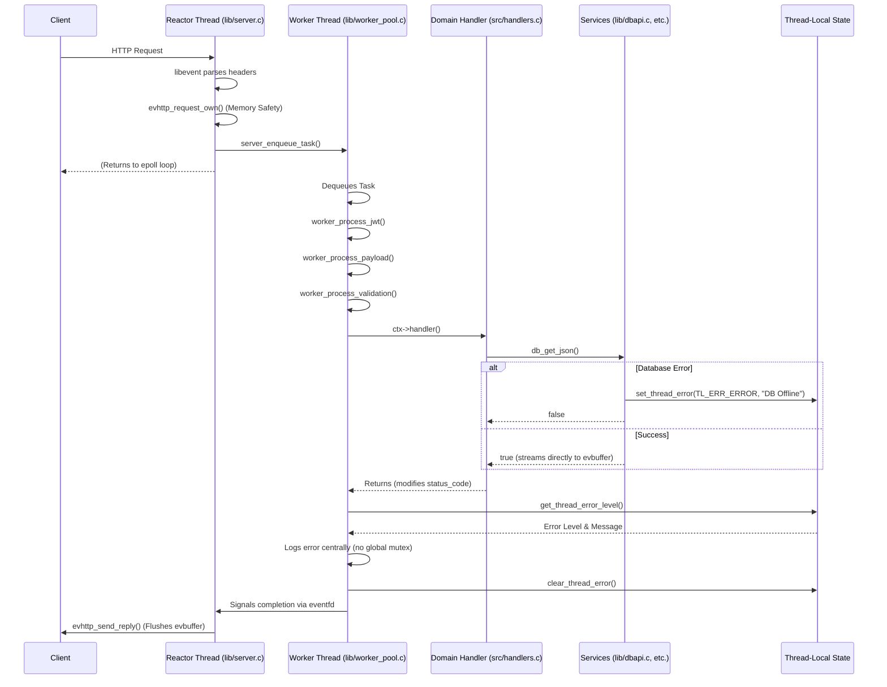

# Guide: Writing a Well-Behaved Database API Handler in EvHttp

This document is a step-by-step guide for C programmers implementing secure, ultra-high-performance API endpoints in `evhttp-apiserver`. 

The core philosophy of this server relies on **Zero-Allocation Data Streaming**. We do not use C libraries to manually construct JSON responses. Instead, SQL Server generates the JSON natively (e.g., using `FOR JSON PATH`), and the C server acts as a highly concurrent proxy, streaming the raw bytes directly from the database driver into the `libevent` network socket buffer.

---

## Step 1: Define the Input Schema

To securely accept JSON input, define a strict schema using `FieldValidator` arrays. This guarantees that malformed requests are rejected with a `400 Bad Request` before they ever reach your handler logic.

```c
// 1. Define custom validators for complex business logic (Optional)
static bool customer_id_validator(
    const json_object *obj, 
    char *err_buf, 
    size_t err_len
) {
    const char *id = json_object_get_string((struct json_object*)(uintptr_t)obj);
    if (!id || strlen(id) != 5) {
        snprintf(err_buf, err_len, "Invalid customer ID format: %s", id ? id : "null");
        return false;
    }
    for (int i = 0; i < 5; ++i) {
        if (!isalpha((unsigned char)id[i])) {
            snprintf(err_buf, err_len, "Invalid customer ID character: %s", id);
            return false;
        }
    }
    return true;
}

// 2. Define the expected fields and their types
// Note: For simple strings, you can use `.max_len = 250` instead of a custom validator!
static const FieldValidator CustomerSchema[] = {
    // We use a custom validator here to enforce the ID is exactly 5 alphabetical chars
    {.field_name = "id", .type = TYPE_STRING, .is_required = true, .max_len = 5, .custom_validator = customer_id_validator}
};

// 3. Wrap it in a ValidationContext
const ValidationContext CustomerContext = {
    .schema = CustomerSchema,
    .schema_count = sizeof(CustomerSchema) / sizeof(CustomerSchema[0]),
    .global_validator = nullptr // Optional: Use for cross-field logic (e.g., start_date < end_date)
};
```

*Note: For complex business invariants involving multiple fields, implement a `global_validator` function (see `sales_invariant_validator` in `handlers.c` as a model).*

---

## Step 2: Implement the Handler Function

The handler function orchestrates the request. By using the `db_get_json` abstraction and a `QueryParam` array, you eliminate all boilerplate connection handling, fetching, and memory allocation.

```c
void customer_handler(struct json_object* body, int* out_status, struct evbuffer* out_buf) {
    // Set default success headers
    *out_status = HTTP_OK;
    
    // 1. Safely extract the pre-validated string
    const char* customer_id = json_get_string(body, "id");
    
    // 2. Map the payload into your SQL Server Stored Procedure parameters
    QueryParam params[] = {
        { .type = PARAM_STRING, .value = customer_id }
    };
    
    // 3. Execute the stored procedure and stream the results DIRECTLY to the network buffer.
    if (!db_get_json(DB_0, "{CALL sp_customer_get(?)}", params, ARRAY_SIZE(params), out_buf)) {
        *out_status = HTTP_INTERNAL;
    }
}
```

### ⚡ Why is this "Well-Behaved"?
* **Zero Allocations:** `db_get_json` reads the `FOR JSON` chunks from SQL Server and pipes them instantly into `out_buf` (`evbuffer_add`). No intermediate `json-c` objects are allocated or freed.
* **Thread-Local DB Multiplexing:** `db_connect` inherently utilizes `_Thread_local` connection pooling. There are **zero mutex locks** acquired during the execution path, allowing horizontal scaling across all CPU cores.

---

## Step 4: Register the Route

Finally, wire the handler into the `libevent` routing table inside `main.c`. To do this, the variable `g_routes[]` must be modified to add the route in `src/main.c`. You map the URI to your handler and validation schema, and specify security context flags.

```c
// Inside src/main.c (in the g_routes array)
{ 
    .path = "/customer", 
    .allowed_method = EVHTTP_REQ_POST, 
    .validation_ctx = &CustomerContext, 
    .handler = &customer_handler, 
    .is_fast = true,   // True if the query is extremely fast (< 5ms)
    .auth_mode = AUTH_JWT  // Require Bearer JWT Authentication
}
```

---

## Fast-Track: Simple Handlers (No Input Parameters)

If your endpoint doesn't accept a JSON payload and simply retrieves global data (like the `/shippers` endpoint), the implementation is even more concise. 

You do **not** need a schema, `ValidationContext`, or parameter binder callback.

### The Handler
Pass `nullptr` and `0` for the parameter arguments in `db_get_json`:

```c
void shippers_handler(
    [[maybe_unused]] struct json_object* body, 
    int* out_status, 
    struct evbuffer* out_buf
) {
    *out_status = HTTP_OK;
        
    // Execute parameterless query and stream directly to client
    if (!db_get_json(DB_0, "{CALL sp_shippers_view}", nullptr, 0, out_buf)) {
        *out_status = HTTP_INTERNAL;
    }
}
```

### The Route Registration
In `src/main.c`, set `.allowed_method = EVHTTP_REQ_GET` and `.validation_ctx = nullptr`:

```c
{ 
    .path = "/shippers", 
    .allowed_method = EVHTTP_REQ_GET, 
    .validation_ctx = nullptr, 
    .handler = &shippers_handler, 
    .is_fast = true, 
    .auth_mode = AUTH_JWT 
}
```

---

## Architectural Highlights to Remember
1. **Never use `json-c` for API Responses:** Building dynamic JSON responses using `json_object_new_*` taxes the heap memory severely. Rely on the database (`FOR JSON`) and `evbuffer` instead.
2. **Lock-Free by Design:** The hot-path architecture has been deliberately designed to avoid Read/Write locks. Do not introduce global state mutexes in your handlers.
3. **Implicit Cleanup:** Connections are tied to the worker thread's lifetime, and the HTTP request lifecycle is managed by `libevent`. Your handler simply returns, and all state (including the parsed input body) is automatically freed by the router.
4. **100% SQL Injection Protection:** By exclusively using ODBC Prepared Statements (`SQLBindParameter`) to map JSON inputs to Stored Procedure variables, the API is natively immune to all SQL Injection attacks. Input values are never concatenated into the query string.

---

## Internals: Separation of Concerns, Thread Safety, and Error Logging



The architecture of EvHttp guarantees zero data races, use-after-free protection, and centralizes side effects like logging. Here's how a request flows through the system securely:

### 1. The Reactor Thread (Network I/O)
The `libevent` reactor threads exclusively handle non-blocking TCP socket I/O. When a complete HTTP request is received:
1. The reactor processes security headers, CORS, and API keys via modular middleware (e.g., `server_validate_cors`, `server_validate_method_and_auth`).
2. **Memory Safety**: The reactor calls `evhttp_request_own(req)` to officially steal ownership of the request memory from `libevent`. This is critical. If the client abruptly disconnects or times out, `libevent` will NOT free the request out from under the background worker thread, completely preventing Use-After-Free vulnerabilities.
3. The reactor packages the request into a task and enqueues it into the Global Inbound Queue via `server_enqueue_task`, then immediately returns to epoll to serve more clients.

### 2. The Worker Thread (The Orchestrator)
The worker thread wakes up, dequeues the task, and executes `worker_thread_main()`. This function is the central orchestrator:
1. **Middleware & Validation**: It delegates authorization (`worker_process_jwt`), payload parsing (`worker_process_payload`), and schema enforcement (`worker_process_validation`) to modular helper functions.
2. **Handler Execution**: It invokes your concise, domain-specific handler (e.g., `customer_handler`).
3. **Response Status Extraction**: Once the handler returns, it inspects the modified integer `task->status_code` (e.g., `200` or `500`). The worker thread handles translating this into the standard HTTP string via `get_http_status_text(code)`.
4. **Centralized Error Logging**: Instead of handlers or low-level services (like `dbapi` or `http_client`) spamming the global logger directly, they use `set_thread_error(...)`. The worker thread pulls this contextual error string via `get_thread_error_level()` and logs it cleanly as `LOG_ERROR` or `LOG_WARN`. This preserves strict separation of concerns and allows 100% unit testing of backend services.
5. **Completion Signaling**: It signals the completion queue and wakes the reactor thread via `eventfd`.

### 3. Thread-Local Error Engine
To maintain strict thread safety across all layers without acquiring mutexes, the error engine relies on `_Thread_local` storage inside `thread_error.c`.
When `dbapi` loses a database connection, it calls `set_thread_error(TL_ERR_ERROR, "Database connection lost")`. Because the storage is `_Thread_local`, this completely avoids data races between concurrent workers. The `worker_thread_main` orchestration loop inspects and clears this error at the end of every task boundary.

---

## Diagnosing Core Dumps on Ubuntu

In the highly unlikely event that the API Server crashes with a segmentation fault or `abort()`, a core dump is generated. On modern Ubuntu systems running Apport, diagnosing these requires specific steps:

### 1. Enabling Core Dumps in the Terminal
By default, the Linux kernel sets the core file size limit to `0` for the user session, silently discarding all crashes. **Before** launching the server, you must bypass this limit:
```bash
ulimit -c unlimited
./bin/apiserver
```

### 2. Finding the Crash Report
Apport intercepts core dumps and wraps them in a compressed crash report file located in `/var/crash/`. Look for a file named similar to:
`/var/crash/_home_ubuntu_evhttp_bin_apiserver.1000.crash`

### 3. Extracting and Analyzing the Core Dump
You cannot feed a `.crash` file directly to GDB. You must first extract the raw `CoreDump` file using `apport-unpack`:
```bash
# Extract the crash report to a temporary directory
apport-unpack /var/crash/_home_ubuntu_evhttp_bin_apiserver.1000.crash /tmp/crash_report

# Run GDB on the exact binary that generated the crash
gdb -batch -ex "bt full" ./bin/apiserver /tmp/crash_report/CoreDump
```

### 4. Important Gotchas
* **Recompilation Breakage:** Never run `make release` after a crash before extracting your backtrace. If the binary is modified, the memory offsets will shift, and GDB will fail to unwind the stack (showing `?? ()`).
* **Debuginfod Timeouts:** If GDB hangs while saying `Downloading separate debug info for /lib/...`, it means Ubuntu's `debuginfod` servers are timing out. You can bypass this by running GDB locally without network symbols, which is usually sufficient to trace the crash back to our application code.
